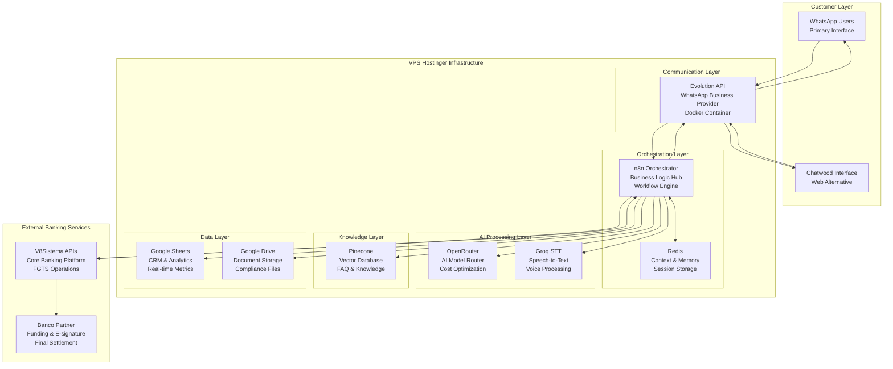

# FGTS AI Agent: WhatsApp-First Financial Services
## Public Report - Module 13 Product-Market Fit Assessment

---

## Executive Summary

**FGTS AI Agent** is a fintech project designed to operate as a **banking correspondent** focused on **automating sales of FGTS Saque-Aniversário** through an **AI agent** that conducts conversations via WhatsApp. The solution integrates **banking APIs** for balance inquiry, lien/annotation at Caixa, and formalization with anti-fraud and e-signature.

The goal is to enable **high throughput with lower commission**, reducing the end customer's cost while preserving the **minimum conversion rules** required by banks—specifically the **relationship between executed balance inquiries and closed sales**, given that the **Caixa API is limited** and **indiscriminate balance checks are not allowed**.

**Current Status:** Module 13 Product-Market Fit Assessment phase. PMF hypotheses have been defined and a testing plan has been created. MVP development and validation testing have not yet begun.

---

## Problem Statement

### Market Challenges

**For Customers (CLT Workers):**
- **Low average ticket** of FGTS Saque-Aniversário receives lower priority from sales representatives
- **High operational volume** that is not viable to handle manually
- **High commissions** (to incentivize sales) increase the customer's total cost
- **Complex journey:** Download app → Register → Upload documents → Wait → Maybe get approved
- **Time delays:** Multiple-day processes from inquiry to funding

**For Financial Institutions:**
- **Minimum operational conversion requirement:** need to keep the **inquiries:sales ratio** within bank-accepted threshold (e.g., **≤ 10:1**, i.e., **conversion rate ≥ 10%**)
- **Caixa API limitations:** the API has limits and **inquiries without sales** can trigger **access restrictions/blocks**
- **Operational scalability challenges:** manual processes don't scale efficiently

**For Banking Correspondents:**
- Need to balance **volume, conversion efficiency, and cost** while respecting API usage constraints
- Difficulty maintaining required inquiry:sales relationships

### Regulatory and Operational Constraints

- **Regulatory risk** of product alteration or extinction
- **API rate-limit and cost** considerations
- **Partner dependency** on banks and promotoras (origination partners)
- **ANEPS certification** requirements
- **Encryption** requirements in transit and at rest

---

## Solution Overview

### Core Approach

**Fintech** operating as a **banking correspondent**, using a **conversational AI agent** orchestrated by **n8n** with an LLM (via **OpenRouter**), integrated with **banking APIs** and **anti-fraud/e-signature** providers. The agent manages the end-to-end journey: **balance inquiry → proposal → lien/annotation → formalization**, focusing on **efficiency, conversion, and security**.

**Key principle:** **Balance inquiry** is **critical for accuracy** because it **prioritizes customers with eligible balances**, increasing the **likelihood of sale**; at the same time, it must be **used sparingly** to **respect API limits** and maintain the **inquiries:sales relationship**.

### Value Proposition

**For Operations (correspondent):**
- Increase **capacity via automation**
- Enable **lower commissions** through efficiency
- Higher **aggregate margin through efficiency**

**For Banks/Investors:**
- Origination at scale with **efficient conversion** (respecting the **inquiries:sales** relationship)
- Integrated **anti-fraud tracks**

**For CLT Customer:**
- **Lower effective cost**
- Improved experience
- **100% digital** journey via WhatsApp

### Customer Journey Vision

```
Customer sends message via WhatsApp: "Preciso de dinheiro do meu FGTS"
    ↓
AI Agent responds with contextual guidance
    ↓
Balance check + simulation in same conversation
    ↓
Proposal + e-signature without leaving WhatsApp
    ↓
Funding process completion
```

**Key features:**
- **No app downloads** required
- **Voice or text** input options
- **Conversational interface** in WhatsApp
- **E-signature in chat**

---

## Technical Architecture

### System Design Principles

The architecture is designed for:
- **Rapid iteration** - change flows in hours, not weeks
- **Cost efficiency** - optimize model selection and API usage
- **Regulatory compliance** - built-in safeguards and monitoring
- **Scalability** - modular components that can grow independently

### Architecture Overview



### Technology Stack with Justifications

| **Component** | **Technology** | **Justification** |
|---|---|---|
| **Orchestration** | n8n | Visual workflow management; change flows in hours, not weeks; crucial for PMF iteration |
| **AI Router** | OpenRouter | No vendor lock-in; pick best model for each task (cost vs accuracy); switch anytime |
| **Speech-to-Text** | Groq | Fast processing (target <3s for short notes); handles Brazilian Portuguese |
| **Memory** | Redis | In-memory database for session context; TTL (24-72h); reduces customer friction |
| **Knowledge Base** | Pinecone | Vector database for FAQ retrieval; score threshold (≥0.78); accurate, compliant answers |
| **CRM (MVP)** | Google Sheets | Fast setup; familiar interface; easy analysis; real-time metrics |
| **Document Storage** | Google Drive | Central, familiar place for contracts, snapshots, and reports; compliance artifacts |
| **Banking APIs** | V8Sistema | Regulated FGTS operations provider; handles balance inquiry, simulations, proposals, liens |
| **Messaging** | Evolution API | WhatsApp Business API provider; webhook support; cost-effective alternative |
| **Hosting** | Hostinger VPS + EasyPanel | VPS pricing more predictable; visual container management; fast setup |

### Key Integrations

**V8Sistema Banking APIs:**
- **Autenticação** - OAuth2 token for secure API calls
- **Consulta de Saldo FGTS** - Fetch customer's FGTS available balance (subject to rate limits)
- **Simulação FGTS** - Generate loan simulation with installments
- **Criação da Proposta** - Submit formal loan proposal
- **Resolvendo Pendências** - Handle missing documents or inconsistencies
- **Cancelando Operação** - Cancel loan operation if user withdraws
- **Consultando Operações** - Retrieve status of submitted proposals
- **Webhooks** - Push notifications from bank to system

**Supporting APIs:**
- **Evolution API (WhatsApp)** - Webhook for inbound messages, send messages, get media, mark read
- **Groq (Speech-to-Text)** - Audio transcription for voice messages
- **Pinecone (Vector Store)** - Upsert, query, delete operations for knowledge base
- **Redis (Memory)** - Get/set session data with TTL
- **Google Drive** - List files, download, upload for document management
- **Google Sheets** - Append row, update row, get values for CRM operations

---

## Module 13 Deliverables by Sprint

### Sprint 1 (Aug 12-25, 2025)
**Deliverables:**
1. **Project Plan** - Structured planning document defining scope, objectives, premises, constraints, and timelines
2. **Project Submission** - Formal submission establishing official baseline for validation

### Sprint 2
**Deliverables:**
1. **Detailed Submission Plan** - Overview document explaining each deliverable, rationale, and role in PMF validation; includes comprehensive KPIs and Success Metrics
2. **PMF Hypotheses** - Set of testable statements about product-market fit with linked KPIs for empirical validation

### Sprint 3
**Deliverables:**
1. **PMF Testing Plan** - Detailed plan describing how each PMF hypothesis will be tested (methods, sample sizes, data sources, timelines)
2. **Technology Justification Reports** - Written justifications for choice of frameworks, languages, and technologies in light of PMF objectives

### Sprint 4
**Deliverables:**
1. **APIs & Integrations** - Documentation of detailed interfaces, service contracts, communication protocols between AI agent, banking APIs, and auxiliary services
2. **Updated Architectural Models & Diagrams** - Refined system architecture diagrams showing components, integrations, and scaling approach

### Sprint 5
**Deliverables:**
1. **Final Presentation** - Presentation summarizing project framework, PMF plan, and architectural decisions
2. **Public Report** (this document) - Written, publicly accessible report detailing Module 13 outcomes

---

## Product-Market Fit Framework

**Status:** PMF hypotheses and testing plan have been defined. Validation testing has not yet begun.

### PMF Hypotheses Defined

#### H1: Channel Preference / Friction
**Hypothesis:** Among CLT workers ≤ 4 × minimum wage and over the age of 40, a WhatsApp-only, "we do it for you" journey produces higher completion and faster TTM (time-to-money) than web/app alternatives.

**Planned Success Criteria:**
- Completion ≥ 70%
- TTM ≤ 4 hours

**Planned Testing Method:** Compare WhatsApp-only vs. traditional app route

#### H2: AI vs Human Cost Parity
**Hypothesis:** AI agent + human on request achieves ≥ 90% of human-only conversion at ≥ 30% lower operational cost per sale.

**Planned Success Criteria:**
- Lead → Sale vs human baseline
- Cost per sale reduction ≥ 30%

**Planned Testing Method:** Compare AI-led conversations vs. human-only baseline

#### H3: Recurrence
**Hypothesis:** Customers re-contract within ≥ 3 months at meaningful rates without paid re-acquisition.

**Planned Success Criteria:**
- ≥ 20% repeat within 90-120 days

**Planned Testing Method:** Track natural re-engagement at 90-120 days with no paid ads

#### H4: Value Proposition Over Pure Price
**Hypothesis:** "Low cost + speed + we-do-it-for-you" wins more often than "lowest price only."

**Planned Success Criteria:**
- +10 percentage points win-rate for concierge copy at same price

**Planned Testing Method:** A/B copy test (concierge vs price-only messaging)

### Defined Metrics Dictionary

**Core Metrics:**
- **Leads/week:** Unique phone numbers that respond to first message
- **Shot:** Conversation that reaches pre-qual + CPF and triggers balance inquiry
- **Shots:Sale:** Shots ÷ funded sales (goal ≤ 60)
- **Flow completion (no human):** Funded sales without handoff_flag ÷ all funded sales

**Time Metrics:**
- **FRT (seconds):** Time(first reply from us) − time(user message)
- **TTM (hours):** Time(funded) − time(user starts)

**Financial Metrics:**
- **Contribution/sale (R$):** (R$ 250 × 0.16) − [LLM costs + message costs + CRM allocation]
- **Acceptance threshold:** ≥ R$ 20

### Planned KPIs for Validation

| **Objective** | **KPI** | **Target** |
|---|---|---|
| **Complete WhatsApp-Only Funnel** | Flow completion (no human) | ≥ 70% |
| | First Response Time (FRT) | median ≤ 5 seconds |
| | Time-to-Money (TTM) | ≤ 24 hours median |
| **Establish Baseline Conversion** | Shots:Sale | ≤ 60:1 (conversion ≥ 1.67%) |
| | Leads/week | ≥ 100 |
| **Unit Economics** | Contribution/sale | ≥ R$ 20 |
| **Experience Quality** | Customer satisfaction (CSAT) | ≥ 4.5/5 |
| | System error rate | < 2% |
| | Rate-limit headroom | daily balance checks < 70% of limit |

### Planned Validation Timeline

- **Weeks 1-2:** Run H1 (WhatsApp-only vs app route) and H2 (AI-led vs human baseline)
- **Weeks 3-4:** Establish H3 cohort and tracking for recurrence
- **Weeks 4-5:** Execute H4 copy test (concierge vs price-only)
- **Ongoing:** Track CSAT, FRT, TTM, contribution/sale in dashboards

**Data sources planned:** WhatsApp logs, Google Sheets (MVP CRM), V8Sistema confirmations, e-signature receipts

---

## Business Model Framework

### Revenue Model
- **Per-operation commission** as banking correspondent (paid by the bank)
- **Sector:** Credit/advance (FGTS)

### Cost Structure
- **Infrastructure** and **AI providers** (main costs)
- Variable costs: conversations, messages, LLM processing, CRM allocation
- Fixed costs: server hosting, compliance, team

### Unit Economics Model (Example)
```
Revenue/sale = ticket × commission% = R$ 250 × 0.16 = R$ 40
Variable cost/sale = (avg conversations/sale × costs) + LLM + CRM share
Target: Contribution/sale ≥ R$ 20 (post-variable costs, pre-media)
```

---

## Risk Management Strategy

### Technical Risks & Mitigation

**API Rate Limits:**
- **Risk:** Caixa API has limits; excessive inquiries without sales trigger access restrictions
- **Mitigation:** Pre-qualify before balance checks; monitor inquiries:sales ratio; throttle if needed

**AI Accuracy:**
- **Risk:** AI may provide incorrect information or fail to handle edge cases
- **Mitigation:** Curated FAQ (Pinecone) with score threshold (≥0.78); human fallback escalation; limited AI scope

**Cost Escalation:**
- **Risk:** AI and messaging costs may rise unexpectedly
- **Mitigation:** Monitor cost per sale weekly; OpenRouter allows switching to cheaper models; optimize flows

### Business Risks & Mitigation

**Regulatory Changes:**
- **Risk:** Product alteration or extinction
- **Mitigation:** Compliance-first architecture; diversification into multiple products planned

**Partner Dependencies:**
- **Risk:** Single bank or API provider failure
- **Mitigation:** Design for multi-bank integration capability

**Conversion Requirements:**
- **Risk:** Not meeting minimum operational conversion (inquiries:sales ≤ 10:1)
- **Mitigation:** Pre-qualification; responsible balance inquiry usage; monitoring and adjustment

### Operational Risks & Mitigation

**System Reliability:**
- **Risk:** Downtime affects customer experience and trust
- **Mitigation:** Container orchestration; monitoring; redundancy planning

**Quality Maintenance:**
- **Risk:** FAQ accuracy degrades over time
- **Mitigation:** Version control in Google Drive; regular content updates; feedback loops

**Scale Challenges:**
- **Risk:** System may not handle volume growth
- **Mitigation:** Modular architecture supports component-level scaling; upgrade path defined (Sheets → CRM; n8n cloud → AWS self-host)

---

## Future Roadmap

### Phase 1: MVP & Validation (Current Module 13 Focus)
- Define PMF hypotheses and testing plan ✓
- Document architecture and API integrations ✓
- Create technology justifications ✓
- Establish baseline metrics framework ✓
- **Next:** Build MVP and execute validation tests (Module 15)

### Phase 2: Scale Foundation (Modules 15-16 and Beyond)
- Develop functional MVP
- Execute PMF validation testing
- Collect user feedback
- Professional CRM migration (Google Sheets → HubSpot/Zoho)
- Infrastructure optimization (n8n cloud → AWS self-host if needed)
- Enhanced dashboards (React/TypeScript)

### Phase 3: Product Expansion (Post-Launch)
- Multi-product expansion (payroll loans, credit cards)
- Advanced AI capabilities (financial planning)
- B2B2C partnerships with banks
- White-label AI agent licensing potential
- Geographic expansion considerations

---

## Key Project Insights

### Strategic Positioning

**"Launch fast, learn fast, spend wisely"** - The technology choices prioritize:
1. **Speed to market** - Visual tools and familiar platforms
2. **Learning velocity** - Easy to change and test hypotheses
3. **Cost control** - Pay only for what's needed; upgrade when justified

### Architectural Strengths

1. **Modular Design:** Swap parts later without scrapping everything
2. **Compliance-by-Design:** Built-in API usage monitoring and rate limiting
3. **Event-Driven:** Real-time processing with webhook integration
4. **Cost Optimization:** Dynamic model selection based on conversation stage
5. **Scalable Infrastructure:** Container-based deployment with clear upgrade path

### Market Opportunity

**Context:**
- Large population accustomed to WhatsApp-based interactions
- Strong need for low-friction, lower-cost financial services
- Banks and correspondents seek scalable, compliant automation

**Anticipated Competitive Advantages:**
- WhatsApp-native experience reduces friction versus app-based flows
- AI-first operations designed for efficiency and scalability
- Compliance-by-design aligned with partner and regulatory needs

---

## Current Status & Next Steps

### Completed (Module 13)
✅ Project plan and submission  
✅ Detailed submission plan with KPIs and success metrics  
✅ PMF hypotheses defined (H1-H4)  
✅ PMF testing plan documented  
✅ Technology stack selected and justified  
✅ API integrations documented  
✅ Architectural models and diagrams created  
✅ Final presentation prepared  
✅ Public report completed  

### Upcoming (Module 14 - Financial Model)
- Cost assumptions report
- Revenue assumptions and pricing strategy
- Detailed financial projection (12+ months)
- Discounted cash flow analysis (5 years)
- Financial scenarios and sensitivity analysis
- Governance and legal compliance (basic processes)

### Future (Module 15 - MVP Development)
- Product development plan (requirements, user stories, roadmap)
- Low-fidelity prototype
- **Functional MVP development**
- User feedback collection on MVP
- Product benchmarking
- Compliance analysis (regulations & ethics)

### Future (Module 16 - Go to Market)
- Launch plan
- Customer onboarding plan
- **PMF validation execution**
- Post-launch business metrics
- Stability and security analysis
- Strategic logs establishment

---

## Conclusion

This project represents a systematic approach to building a WhatsApp-first financial services platform for FGTS Saque-Aniversário. Through Module 13, we have:

1. **Clearly defined the problem space** - market friction, regulatory constraints, and operational challenges
2. **Designed a solution framework** - conversational AI with banking API integration
3. **Established PMF hypotheses** - testable statements about channel preference, AI efficiency, recurrence, and value proposition
4. **Created a validation roadmap** - structured testing plan with defined metrics and timelines
5. **Documented technical architecture** - modular, scalable design optimized for rapid iteration
6. **Justified technology choices** - each component selected for specific business benefits

**Important Note:** This project is currently in the **planning and design phase**. PMF validation testing has not yet been conducted, and the MVP has not yet been built. The hypotheses, targets, and metrics documented here represent the **framework for future validation**, not validated results.

The next phases will focus on building the functional MVP, executing the validation tests, and collecting real-world data to confirm or refine these hypotheses.

---

## Contact Information

**Project Lead:** Felipe Martins Moura  
**Project Type:** Entrepreneurship  
**Current Module:** 13 - Product-Market Fit Assessment  
**Current Status:** PMF framework defined; MVP development pending  

---

## Appendix: Project Premises and Constraints

### Premises
- Access to a **bank API** (V8Sistema)
- **ANEPS certification** obtainable
- **Server** (cloud/dedicated) available
- Available **LLM** (via OpenRouter)
- **Anti-fraud/e-signature** providers accessible
- **Encryption** in transit and at rest implementable
- **Responsible use of balance inquiry** to prioritize customers with eligible balances

### Constraints
- **Minimum operational conversion:** maintain **inquiries:sales ≤ 10:1** (≈ **conversion ≥ 10%**)
- **Caixa API limits** (rate-limit and low tolerance for inquiries without sales)
- **Regulatory risk** (product may change or be discontinued)
- **Transactional API costs**
- **Partner dependency** (bank, promotoras)
- **Academic deadlines** for deliverables

---